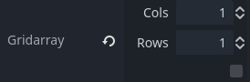
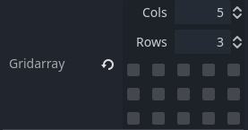
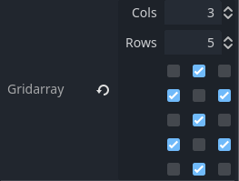

# Godot Grid Array


Display boolean arrays as a grid of checkboxes in the inspector.

## Usage

Include `GridArray` or `grid_array` (not case-sensitive) in your exported Array's name.

### GDScript

```gdscript
@export
var Grid_arrayExample: Array
@export
var gridArraysample: Array
```

### C#

```csharp
[Export]
public Array<bool> TestGridArray { get; private set; } = new();

[Export]
private Array<bool> _grid_array_ = new();
```

## Screenshots



